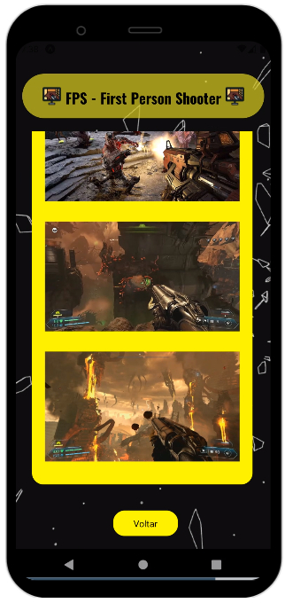
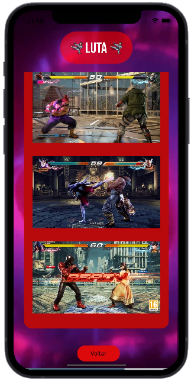
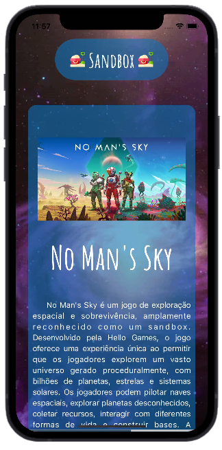

Um app feito para atividade na época em que a sala aprendeu navegação. Jogos escolhidos por mim

  <h3>Menu com dropdown</h3>
   

  

  <h3>Página falando de alguns jogos FPS</h3>
   

  

  <h3>Página falando de alguns jogos de luta</h3>
   

  

  <h3>Página falando de alguns jogos roguelike e roguelite</h3>
   

  

  <h3>Página falando de alguns jogos sandbox</h3>
   

 
Aqui o link do snack: https://snack.expo.dev/@romulojr/appgamesnavegacao
